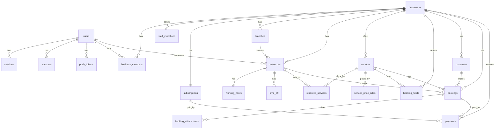

# Database Schema — OutletBooking

Full DDL: [`docs/schema.sql`](schema.sql) (validated on PostgreSQL 16). The Drizzle schema in `packages/db` must match it.

## Key conventions
| Rule | Detail |
|---|---|
| Primary keys | `integer GENERATED ALWAYS AS IDENTITY` on every table |
| Foreign keys | `integer`, always with an index |
| Tenant-safe FKs | Child tables reference parents with **composite FKs `(business_id, x_id)`**, so a booking can never point to another business's resource, service or customer — enforced by the database |
| Public identifiers | Integer IDs are guessable, so they are **never in public URLs**. Booking page uses `businesses.slug`; confirmation/cancel links use `bookings.public_token` (random hex); payments use ToyyibPay `bill_code` |
| Money | integer sen (`*_sen`), MYR |
| Time | `timestamptz` (UTC); working hours as local `time` + `weekday` (0 = Sunday) |
| Enums | `text` + `CHECK` constraints |
| Double booking | `EXCLUDE USING gist` on `bookings (resource_id, blocked time range)` for pending/confirmed/checked_in |
| Audit columns | `created_at`, `updated_at` (trigger) on every table; `deleted_at` soft delete on businesses, resources, services, customers |
| Auth | Better Auth configured for **numeric IDs** and snake_case table/column names (`users`, `sessions`, `accounts`, `verifications`) |

## Entity relationship diagram

## Tables
| Group | Table | Purpose | Key columns |
|---|---|---|---|
| Auth | users | Login accounts (owner, staff) | id, name, email, phone |
| Auth | sessions, accounts, verifications | Managed by Better Auth | user_id |
| Auth | push_tokens | Expo push tokens per device | user_id, token, platform |
| Tenant | businesses | One row per business; booking rules | id, slug, template, resource_label, slot_interval_min, min_advance_min, max_days_ahead, cancel_cutoff_min, pending_expiry_min |
| Tenant | business_members | User ↔ business with role | business_id, user_id, role (owner/staff), can_view_all |
| Tenant | staff_invitations | Email invites for staff | business_id, email, resource_id, token, expires_at |
| Tenant | subscriptions | 7-day trial and paid plan | business_id, plan, status, trial_ends_at, current_period_end |
| Setup | branches | Outlets/locations | business_id, name, address, lat/long |
| Setup | resources | Anything bookable (agent, bay, court, room, property) | business_id, branch_id, resource_type, user_id |
| Setup | services | What customers book | duration_min, duration_options[], price_unit, price_sen, deposit_sen, prepay_full, buffer_min, travel_buffer_min, location_type |
| Setup | service_price_rules | Peak / off-peak pricing | service_id, weekday, start_time, end_time, price_sen |
| Setup | resource_services | Which resource can do which service | resource_id, service_id |
| Setup | working_hours | Weekly hours (several ranges per day = breaks) | resource_id, weekday, start_time, end_time |
| Setup | time_off | Leave, holidays, closures (resource_id NULL = whole business) | resource_id, start_at, end_at |
| Setup | booking_fields | Custom form fields per niche | service_id, field_key, label, field_type, options, is_required, is_searchable |
| Booking | customers | Per-business customer, unique by phone | business_id, name, phone (E.164) |
| Booking | bookings | Appointments | public_token, resource_id, service_id, customer_id, start_at, end_at, blocked_start_at, blocked_end_at, status, source, price_sen, amount_due_sen, payment_status, location_address, custom_fields, result_notes, expires_at |
| Booking | booking_attachments | Inspection photos, documents | booking_id, file_key, content_type |
| Payment | payments | ToyyibPay bills for bookings or subscriptions | purpose, bill_code, amount_sen, status, transaction_ref, raw_callback |

## Pilot niche mapping
| Niche | resources | services | booking_fields (examples) |
|---|---|---|---|
| Real estate viewing | `staff` (agents) | Viewing 30 min, `location_type = at_customer_location`, travel_buffer_min 30 | property_ref, viewing_address, buyer_or_tenant |
| Vehicle inspection | `bay` or `staff` (inspector) | Pre-purchase 60 min; Mobile inspection (`at_customer_location`) | plate_number (searchable), make_model, year |
| Sports booking | `court` | Badminton 60 min, `duration_options {60,120,180}`, `price_unit per_block`, `prepay_full`, peak rules | players |

## Booking time fields
- `start_at` / `end_at`: what the customer sees.
- `blocked_start_at` / `blocked_end_at`: the time the resource is actually unavailable (start − travel buffer, end + buffer/travel buffer). The API calculates these; the exclusion constraint uses them.
- Active statuses that block a slot: `pending`, `confirmed`, `checked_in`. Cancelling or marking `no_show` frees the slot.

## Validated behaviour (PostgreSQL 16)
| Test | Result |
|---|---|
| Schema creates cleanly (21 tables) | ✅ |
| Overlapping booking on same resource | ❌ rejected by `bookings_no_overlap` |
| Booking using another business's resource | ❌ rejected by composite FK |
| Back-to-back booking (11:00 after 10:00–11:00) | ✅ allowed |
| New booking in a cancelled booking's slot | ✅ allowed |
